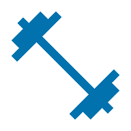
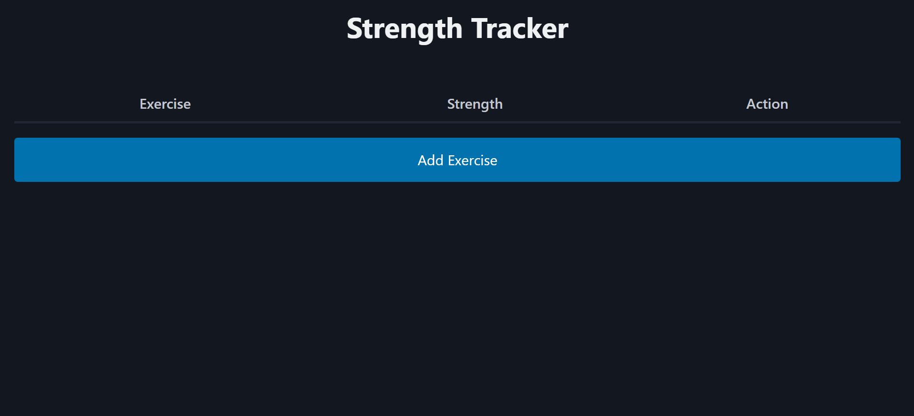
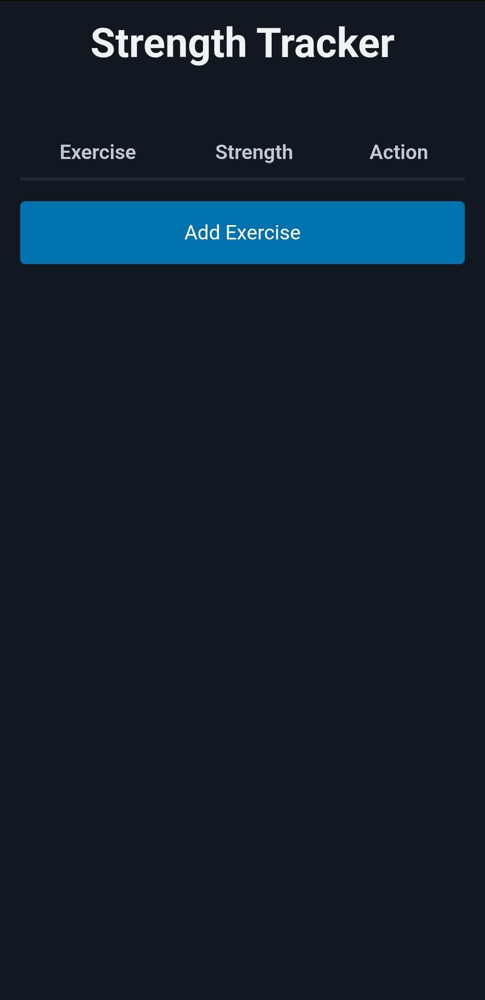

# Strength Tracker

A minimal workout tracker built with Go.

---

## 📌 About

**Strength Tracker** helps you track your workouts and training progress.

Record exercises with load and repetitions, then review your workout history and progression over time.

The application is designed to be lightweight, fast, and simple with a minimal frontend and no unnecessary complexity.

The application is PWA ready and can be used like a native application.

No external dependencies are required.

---

## 🖼️ Screenshots

### Desktop

### Mobile

---

## 🛠️ Built With

- Go
- Pico CSS
- Chart.js
- Font Awesome

All assets are bundled locally.

---

## 📚 Related Projects

- [Consumption Tracker](https://github.com/lukas-arnold/consumption-tracker)
- [Garden Equipment Log](https://github.com/lukas-arnold/garden-equipment-log)

---

## 📄 License

MIT License
